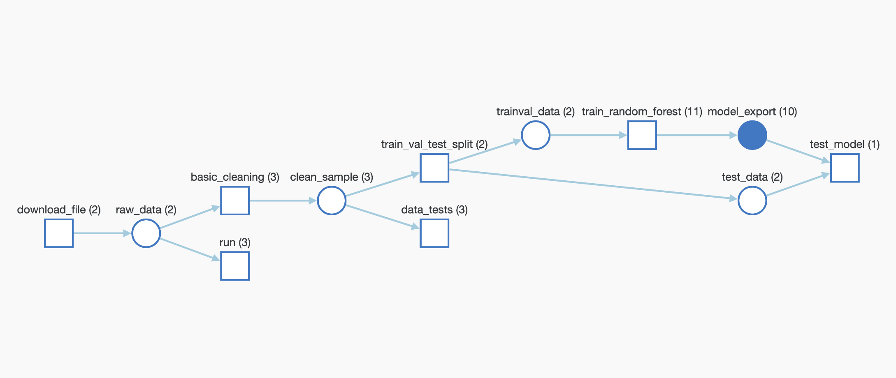

# Build an ML Pipeline for Short-Term Rental Prices in NYC

## Project description
Pipeline for a property management company renting rooms and properties for short periods of 
time on various rental platforms. We need to estimate the typical price for a given property based 
on the price of similar properties. The company receives new data in bulk every week. The model needs 
to be retrained with the same cadence, necessitating an end-to-end pipeline that can be reused.

The objective is to make the pipeline reproducible. For that purpose we use: 
  - Weights & Biases for:
     - experiment tracking
     - artifact tracking
     - model repository
  - MLflow and Hydra for orchestration.

**WandB:** [Weights and Biases link](https://wandb.ai/geodego/nyc_airbnb?workspace=user-geodego)

## Code organisation

The pipeline is made of six components each represented by a folder:
  - get_data: download and log the data
  - eda: exploratory data analysis. Used for basic cleaning
  - basic_cleaning: preprocess the raw data
  - data_check: Regroup tests on our data. This is done using Pytest. 
  - segregate: split data in train/test
  - train_random_forest: Fit the random forest. 
  - evaluate

The pipeline as represented by W&B after running the code is as follow:


## Requirements
packages requirements:

  - wandb~=0.10.31
  - mlflow~=1.14.1
  - pandas~=1.2.3
  - numpy~=1.22.2
  - matplotlib~=3.3.4 
  - omegaconf~=2.0.6
  - setuptools~=59.8.0

Environments with specific packages are built for each component when executing the pipeline.

### Create environment
Make sure to have conda installed and ready, then create a new environment using the ``environment.yml``
file provided in the root of the repository and activate it:

```bash
> conda env create -f environment.yml
> conda activate nyc_airbnb_dev
```

### Get API key for Weights and Biases
Make sure we are logged in to Weights & Biases. Get your API key from W&B by going to 
[https://wandb.ai/authorize](https://wandb.ai/authorize) and click on the + icon (copy to clipboard), 
then paste your key into this command:

```bash
> wandb login [your API key]
```

You should see a message similar to:
```
wandb: Appending key for api.wandb.ai to your netrc file: /home/[your username]/.netrc
```

### The configuration
The parameters controlling the pipeline are defined in the ``config.yaml`` file defined in
the root of the starter kit. We will use Hydra to manage this configuration file.

### Running the entire pipeline or just a selection of steps
In order to run the pipeline when you are developing, you need to be in the root of the starter kit, 
then you can execute as usual:

```bash
>  mlflow run .
```
This will run the entire pipeline.

When developing it is useful to be able to run one step at the time. Say you want to run only
the ``download`` step. The `main.py` is written so that the steps are defined at the top of the file, in the 
``_steps`` list, and can be selected by using the `steps` parameter on the command line:

```bash
> mlflow run . -P steps=download
```
If you want to run the ``download`` and the ``basic_cleaning`` steps, you can similarly do:
```bash
> mlflow run . -P steps=download,basic_cleaning
```
You can override any other parameter in the configuration file using the Hydra syntax, by
providing it as a ``hydra_options`` parameter. For example, say that we want to set the parameter
modeling -> random_forest -> n_estimators to 10 and etl->min_price to 50:

```bash
> mlflow run . \
  -P steps=download,basic_cleaning \
  -P hydra_options="modeling.random_forest.n_estimators=10 etl.min_price=50"
```


### Train the model on a new data sample

To train the model on a new sample of data:

```bash
> mlflow run https://github.com/[your github username]/nd0821-c2-build-model-workflow-starter.git \
             -v [the version you want to use, like 1.0.0] \
             -P hydra_options="etl.sample='sample2.csv'"
```

## License

[License](LICENSE.txt)
